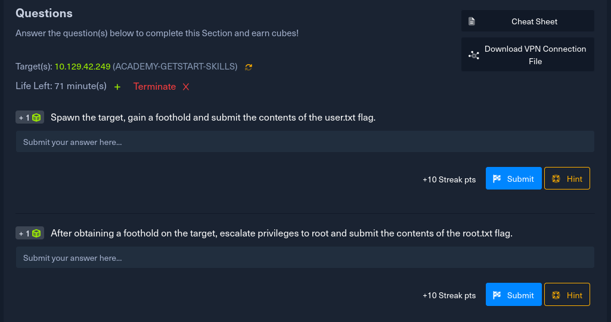
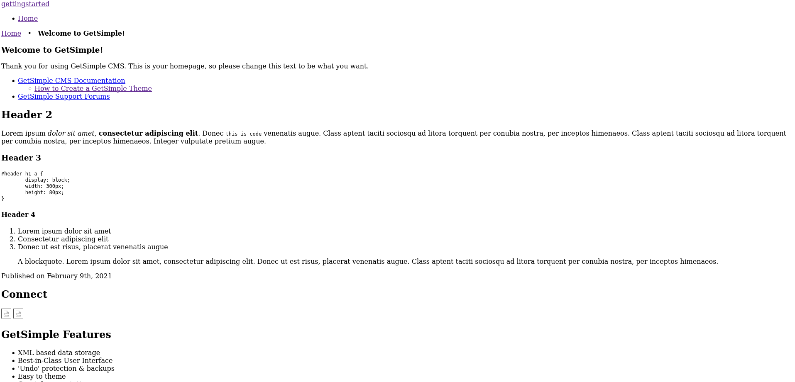
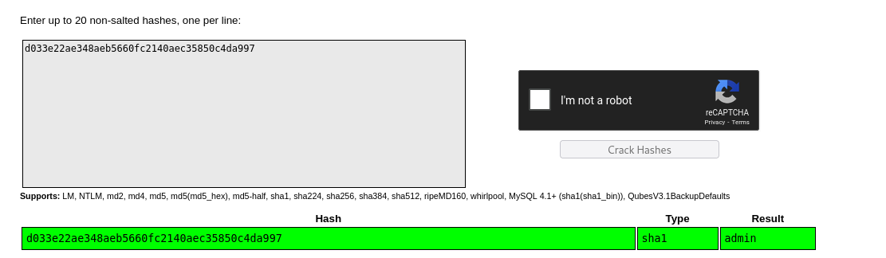
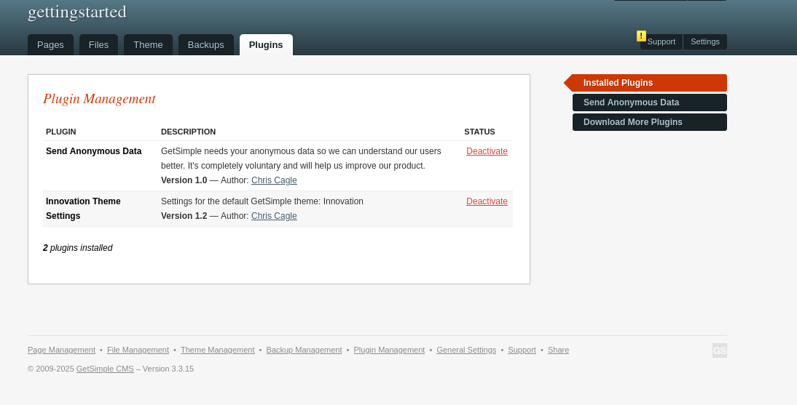

# Decription



# Solve

Đầu tiên ta truy cập vào ip target trên google.




Title của nó là GetSimple. 

Module metaploit có thể sẽ có lỗi này. Tôi đã thử lên google và tìm GetSimple exploit và có 1 lỗi có thể khai thác là GetSimpleCMS PHP File Upload Vulnerability.

-> có 2 cách khai thác.


1 trang web viết bằng html, tôi thử inspect trang web nhưng không thu lại được gì.

DÙng gobuster để brute-force xem các thư mục nào được phép truy cấp.


```c
 └────╼ ❯❯❯ gobuster dir -u http://10.129.42.249/ -w /home/long/common.txt
===============================================================
Gobuster v3.6
by OJ Reeves (@TheColonial) & Christian Mehlmauer (@firefart)
===============================================================
[+] Url:                     http://10.129.42.249/
[+] Method:                  GET
[+] Threads:                 10
[+] Wordlist:                /home/long/common.txt
[+] Negative Status codes:   404
[+] User Agent:              gobuster/3.6
[+] Timeout:                 10s
===============================================================
Starting gobuster in directory enumeration mode
===============================================================
/.htaccess            (Status: 403) [Size: 278]
/.hta                 (Status: 403) [Size: 278]
/.htpasswd            (Status: 403) [Size: 278]
/admin                (Status: 301) [Size: 314] [--> http://10.129.42.249/admin/]
/backups              (Status: 301) [Size: 316] [--> http://10.129.42.249/backups/]
/data                 (Status: 301) [Size: 313] [--> http://10.129.42.249/data/]
/index.php            (Status: 200) [Size: 5485]
/plugins              (Status: 301) [Size: 316] [--> http://10.129.42.249/plugins/]
/robots.txt           (Status: 200) [Size: 32]
/server-status        (Status: 403) [Size: 278]
/sitemap.xml          (Status: 200) [Size: 431]
/theme                (Status: 301) [Size: 314] [--> http://10.129.42.249/theme/]
Progress: 4295 / 4750 (90.42%)[ERROR] Get "http://10.129.42.249/temporary": context deadline exceeded (Client.Timeout exceeded while awaiting headers)
Progress: 4440 / 4750 (93.47%)[ERROR] Get "http://10.129.42.249/tx": context deadline exceeded (Client.Timeout exceeded while awaiting headers)
Progress: 4750 / 4750 (100.00%)
===============================================================
Finished
===============================================================


```

gobuster chỉ ra admin, backups, data, /robots.txt, /sitemap.xml ,/theme  là những thư mục được phép truy cập. 

Tôi đã vào từng thư mục và trong http://10.129.42.249/data/users/admin.xml có chứa tài khoản và mật khẩu.

```c
<item>
<USR>admin</USR>
<NAME/>
<PWD>d033e22ae348aeb5660fc2140aec35850c4da997</PWD>
<EMAIL>admin@gettingstarted.com</EMAIL>
<HTMLEDITOR>1</HTMLEDITOR>
<TIMEZONE/>
<LANG>en_US</LANG>
</item>
```

user = admin
pasword = sha1 "d033e22ae348aeb5660fc2140aec35850c4da997"

Tôi sử dụng crackstation để giải mã pasword



password = admin

Truy cập vào /admin sẽ là trang đăng nhập.




Ở trang web sau khi đăng nhập với administrator ta có thể sử dụng plugins để gửi mã độc lên.


Cách 2 là dùng metasploit

Như đã đề cập, trên gg có lỗi là : GetSimpleCMS PHP File Upload Vulnerability

dùng lệnh msfconsole và tìm lỗi này. 

Có 2 phiên bản lỗi. 

1 là cần xác thực đăng nhập và 1 thì không cần .


Đặt RHOSTS = ip mục tiêu
LHOST là ip attack

run đẻ chạy và boom -> lấy được shell với user.


Kiểm tra sudo -l để xem quyền thì có 1 đường dẫn đến php cho phép mọi người có thể chạy.

Lên GFTObins để kiếm php và nhập lệnh sudo -> leo được root.


